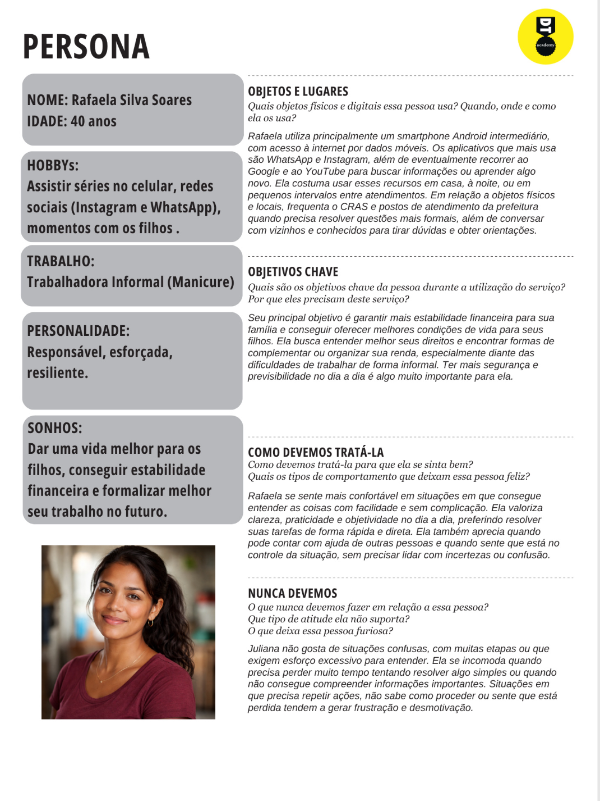
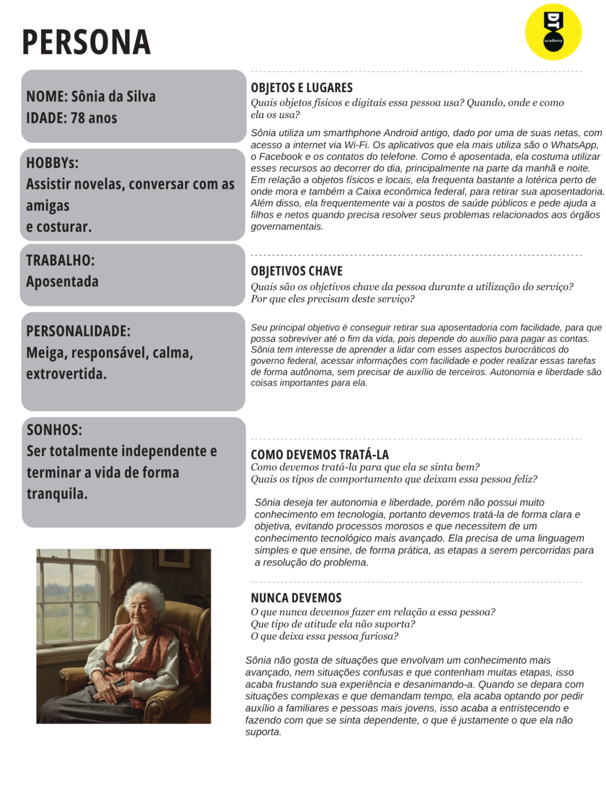
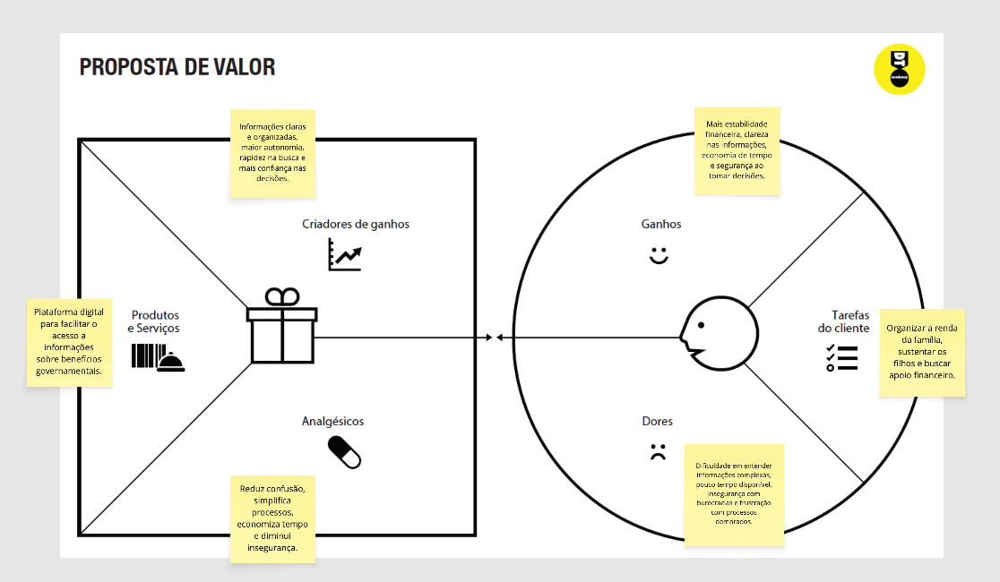
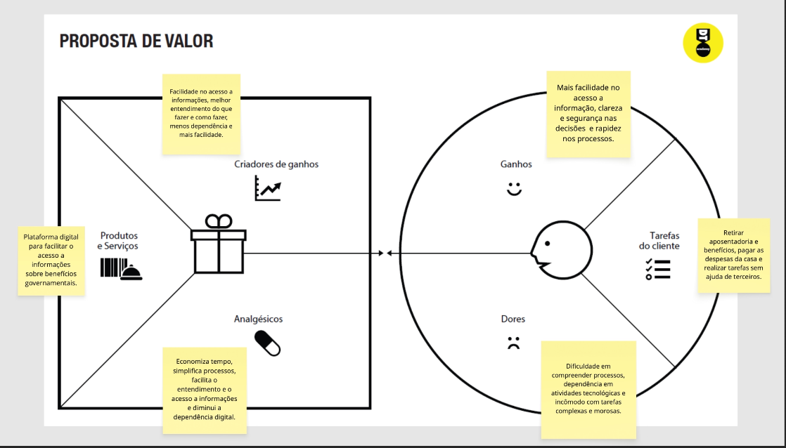
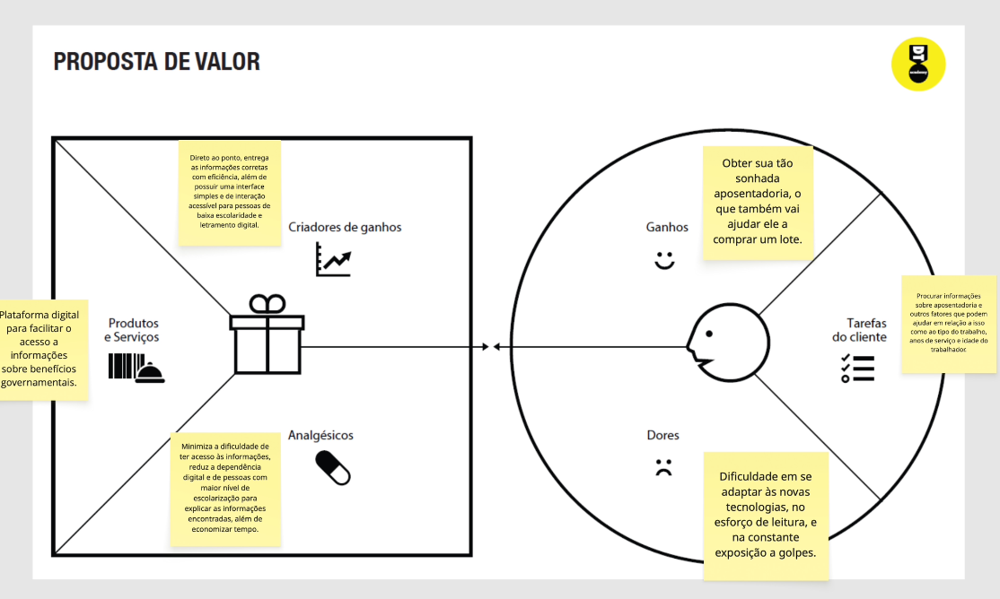
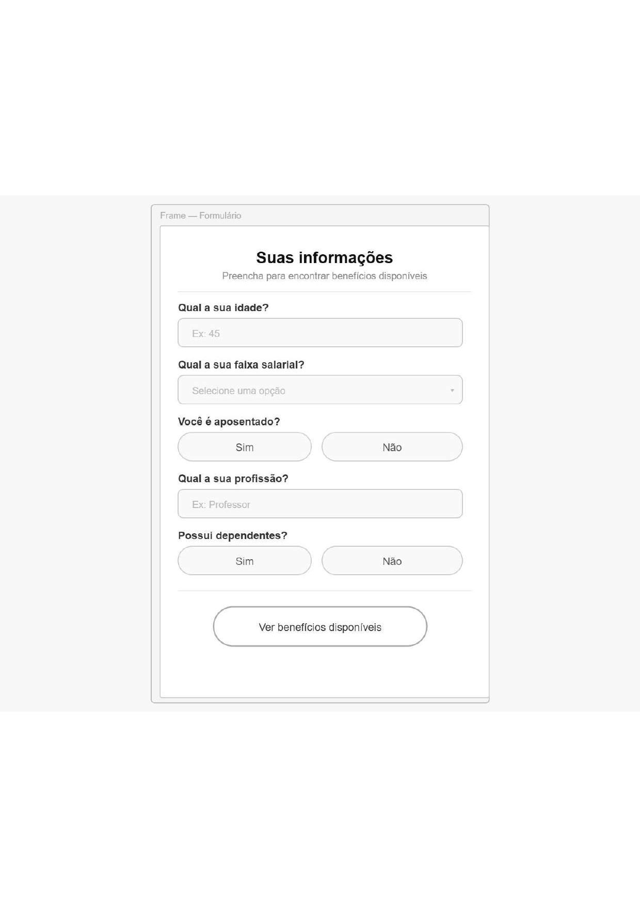
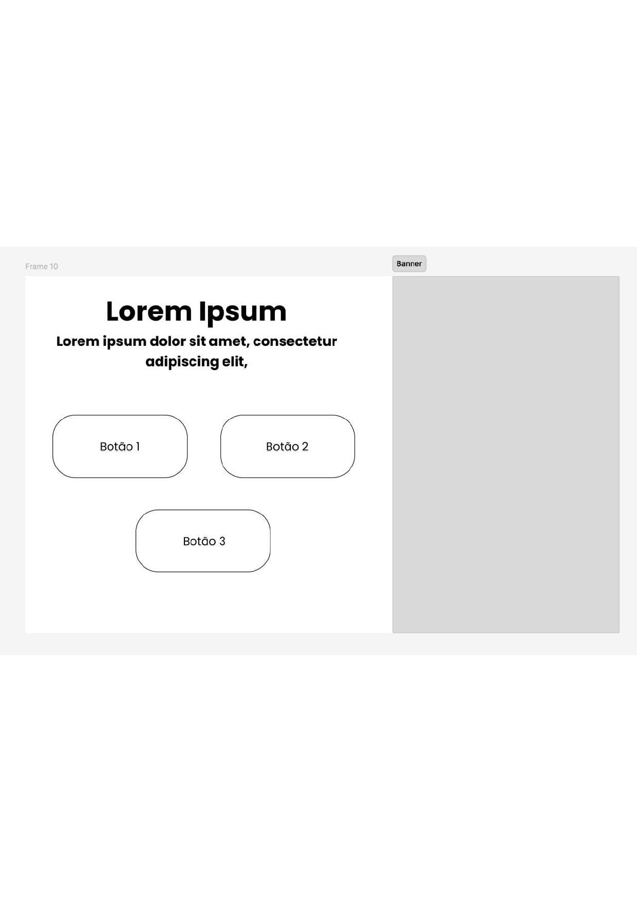

# Introdução

Informações básicas do projeto.

* **Projeto:** Guia-Beneficio
* **Repositório GitHub:** (https://github.com/ICEI-PUC-Minas-PMGES-TI/pmg-es-2026-1-ti1-0438100-prism-1.git)
* **Membros da equipe:**

  * [Theo Goulart Cardoso Vasconcelos](https://github.com/TheoGoulart333) 
  * [Daniel Heber de Souza Godinho](https://github.com/DETTRANN)
  * [Paulo César Silva Monteiro](https://github.com/PauloCesar0709)
  * [Lucas Gomes Esteves da Silva](https://github.com/LukasGom3s)
  * [Mateus Canuto Marques](https://github.com/MATEUSCANUTOPUC)
  * [Giovanni Oliveira Martins Rosa](https://github.com/Giovanni229-bit)
  * [Bernardo Alvim Fagundes de Andrade](https://github.com/beAndradeAf)
    
A documentação do projeto é estruturada da seguinte forma:

1. Introdução
2. Contexto
3. Product Discovery
4. Product Design
5. Metodologia
6. Solução
7. Referências Bibliográficas

✅ [Documentação de Design Thinking (MIRO)](files/processo-dt.pdf)

# Contexto

Detalhes sobre o espaço de problema, os objetivos do projeto, sua justificativa e público-alvo.

## Problema

Diante da dificuldade de centralização e simplificação das informações sobre direitos sociais, define-se o seguinte problema:

"Quais são os principais obstáculos informacionais que impedem os cidadãos brasileiros de identificarem e solicitarem os benefícios governamentais de forma autônoma?"

## Objetivos

Objetivo Geral:

Analisar e identificar as barreiras de acesso à informação sobre benefícios governamentais, visando compreender como facilitar o caminho entre o cidadão e seus direitos

Objetivos Específicos:

- Levantar os principais benefícios governamentais vigentes e seus requisitos básicos

- Identificar as maiores dúvidas e suposições da população em relação ao acesso a auxílios (através da Matriz CSD)

- Mapear os fluxos atuais de busca por informações governamentais e identificar pontos de fricção

- Propor diretrizes de organização de conteúdo que tornem as informações mais claras para o público-alvo

## Justificativa

A realização deste estudo justifica-se pela necessidade de democratizar o acesso à informação pública de natureza social. Para a sociedade, a relevância reside no potencial de reduzir a exclusão social causada pela desinformação, garantindo que direitos constitucionais sejam efetivamente exercidos. Do ponto de vista acadêmico e profissional para estudantes de tecnologia, o estudo permite explorar como o design de interface e a arquitetura de informação podem ser aplicados para resolver problemas sociais complexos, transformando dados brutos do governo em conhecimento útil e acessível para o cidadão comum

## Público-Alvo

# Mercado e Público-Alvo

## 1. Mercado: GovTech e Tecnologia Social

A solução está inserida no ecossistema de **GovTechs** e inovação para o setor público. O foco primordial não é o lucro comercial direto, mas a eficiência na entrega de serviços públicos e o fortalecimento da cidadania

* **Cenário Atual:** Atualmente, o mercado é dominado por portais governamentais robustos (como o Gov.br), que, embora completos, são densos e burocráticos. Existe uma lacuna para soluções de **"última milha"** — ferramentas que traduzam essa complexidade para a linguagem do cidadão comum
* **Oportunidade:** Alta demanda por interfaces simplificadas que operem com fluidez em dispositivos móveis de baixo desempenho e sob conexões de internet instáveis

---

## 2. Perfil Detalhado dos Usuários

### A. Conhecimentos Prévios e Alfabetização Informacional

* **Domínio de Termos:** O usuário típico desconhece o vocabulário administrativo (ex: *"cadastramento"*, *"deferimento"*, *"per capita"*). O seu conhecimento sobre direitos é fragmentado, baseado em fontes informais como rádio, TV ou boatos de redes sociais.
  
* **Barreira Linguística:** Existe dificuldade em interpretar textos longos ou instruções com múltiplos passos. A busca por informação é feita de forma direta e urgente (ex: *"como receber o auxílio gás"*)

### B. Relação com a Tecnologia (Inclusão Digital)

* **Uso de Dispositivos:** O acesso é feito quase exclusivamente via dispositivos móveis. Trata-se de aparelhos, na sua maioria, de entrada ou gerações antigas, com limitações de memória e processamento
  
* **Comportamento Digital:** O usuário domina ferramentas visuais e de áudio (como o WhatsApp), mas sente-se intimidado por formulários complexos e interfaces que exigem login/senha ou múltiplos redirecionamentos
  
* **Custo de Conectividade:** A experiência é ditada pela disponibilidade de dados móveis. A solução deve ser leve para não consumir o plano de dados limitado do usuário

### C. Relações Hierárquicas e Psicossociais

* **Posição de Vulnerabilidade:** O cidadão sente-se frequentemente numa posição de inferioridade perante o Estado. A burocracia é vista como um obstáculo intransponível, gerando frustração e desistência
  
* **Mediação Interpessoal (Rede de Apoio):** É comum a existência de uma hierarquia de apoio familiar. Idosos ou pessoas com baixa alfabetização digital dependem de um "mediador" (neto, vizinho ou agente comunitário). A ferramenta deve servir tanto ao beneficiário final quanto ao facilitador

---

## 3. Mapa de Stakeholders (Partes Interessadas)

O mapeamento abaixo descreve a rede de influência ao redor da solução:

### **Stakeholders Primários (Usuários Diretos)**

* Cidadãos em situação de insegurança financeira
* Trabalhadores informais e rurais que buscam regularização
* Pessoas com Deficiência (PcD) e idosos que buscam auxílios específicos

### **Stakeholders Secundários (Facilitadores)**

* **Assistentes Sociais (CRAS/CREAS):** Podem utilizar a aplicação como guia rápido nos seus atendimentos
* **Líderes Comunitários:** Replicam a informação em bairros periféricos e zonas rurais
* **Familiares:** Jovens que realizam a pesquisa para os mais velhos
* 
### **Stakeholders Terciários (Provedores de Dados)**

* **Órgãos Governamentais (MDS, INSS, Caixa Econômica):** Instituições que detêm as regras, os dados e os fundos dos benefícios

---

## 4. Síntese do Público-Alvo

| Atributo | Descrição para o Projeto |
| :--- | :--- |
| **Escolaridade** | Fundamental incompleto a Médio. |
| **Principais Apps** | WhatsApp, Facebook, YouTube e Apps Bancários. |
| **Dificuldade Central** | Entender as regras para ter acesso ao direito. |
| **Expectativa** | Rapidez, clareza e segurança na informação. |
| **Relação com o Estado** | Desconfiança e sensação de burocracia excessiva. |


 - Pessoas idosas
 - Famílias de baixa renda
 - Trabalhadores informais
 - Pessoas desempregadas
 - Pessoas em vulnerabilidade social
 - Pessoas com deficiência
 - Trabalhadores rurais
 - Pessoas com baixa alfabetização digital

# Product Discovery

## Etapa de Entendimento


## Etapa de Definição

# Personas e Mapas de Empatia

Este documento apresenta as personas identificadas no projeto, juntamente com seus respectivos mapas de empatia, representando os principais usuários da solução

---

# Persona 1: Rafaela Silva Soares



**Idade:** 40 anos  
**Ocupação:** Trabalhadora Informal (Manicure)

## Bio

Rafaela é uma trabalhadora informal que atua como manicure e busca estabilidade financeira para sustentar sua família. Utiliza o celular como principal ferramenta no dia a dia.

## Objetivos

- Estabilidade financeira  
- Melhorar a vida dos filhos  
- Entender seus direitos  
- Organizar sua renda  

## Dores

- Dificuldade com burocracia  
- Informações confusas  
- Falta de clareza sobre direitos  

## Objetos e Lugares

- Smartphone Android  
- WhatsApp, Instagram, Google, YouTube  
- CRAS e postos da prefeitura  

---

## Mapa de Empatia — Rafaela

### Vê
- Pessoas em situação financeira semelhante  
- Conteúdos em redes sociais  
- Filas e burocracia  

### Ouve

- Conselhos de vizinhos e familiares  
- Informações sobre benefícios  

### Pensa e sente

- Preocupação financeira  
- Insegurança  
- Desejo de estabilidade  

### Fala e faz

- Busca ajuda de conhecidos  
- Usa celular para aprender  
- Trabalha diariamente  

### Dores

- Processos complicados  
- Falta de clareza  

### Ganhos

- Segurança financeira  
- Autonomia  
- Facilidade no acesso à informação  

---

# Persona 2: Sônia da Silva



**Idade:** 78 anos  
**Ocupação:** Aposentada  

## Bio
Sônia é aposentada e depende de sua renda para sobreviver. Possui dificuldade com tecnologia, mas deseja ser mais independente.

## Objetivos

- Acessar aposentadoria com facilidade  
- Ter autonomia  
- Entender processos  

## Dores

- Dificuldade com tecnologia  
- Dependência de terceiros  
- Sistemas complexos  

## Objetos e Lugares

- Smartphone antigo  
- WhatsApp, Facebook  
- Lotérica, Caixa, postos de saúde  

---

## Mapa de Empatia — Sônia

### Vê

- Pessoas usando tecnologia com facilidade  
- Informações difíceis de entender  

### Ouve

- Ajuda de filhos e netos  
- Informações sobre benefícios  

### Pensa e sente

- Insegurança  
- Medo de errar  
- Desejo de independência  

### Fala e faz

- Pede ajuda  
- Evita tecnologia  
- Resolve presencialmente  

### Dores

- Processos difíceis  
- Falta de clareza  
- Dependência  

### Ganhos

- Autonomia  
- Tranquilidade  
- Facilidade de uso  

---

# Persona 3: Jailson Pereira


**Idade:** 62 anos  
**Ocupação:** Agricultor  

## Bio

Jailson é agricultor e prefere soluções práticas. Não tem familiaridade com tecnologia, mas precisa dela para acessar benefícios.

## Objetivos
- Conseguir aposentadoria  
- Resolver problemas rapidamente  
- Comprar um lote  

## Dores

- Dificuldade com tecnologia  
- Sistemas lentos  
- Processos longos  

## Objetos e Lugares

- Smartphone antigo  
- Uso ocasional  
- TV, rádio  
- Ajuda de terceiros  

---

## Mapa de Empatia — Jailson

### Vê

- Falta de acesso fácil a serviços  
- Pessoas com mais facilidade digital  

### Ouve

- Orientações de familiares  
- Informações sobre benefícios  

### Pensa e sente

- Frustração com tecnologia  
- Desejo de praticidade  
- Cansaço do trabalho  

### Fala e faz

- Prefere soluções diretas  
- Evita tecnologia  
- Busca ajuda quando necessário  

### Dores

- Sistemas complexos  
- Demora  
- Falta de clareza  

### Ganhos

- Rapidez  
- Simplicidade  
- Eficiência  
- Independência  

---

# Conclusão

As personas representam diferentes perfis de usuários que enfrentam dificuldades com tecnologia e acesso a serviços.  
Os mapas de empatia ajudam a compreender melhor suas necessidades, dores e expectativas, orientando o desenvolvimento de soluções mais acessíveis, simples e eficientes

---

# Product Design

Nesse momento, vamos transformar os insights e validações obtidos em soluções tangíveis e utilizáveis. Essa fase envolve a definição de uma proposta de valor, detalhando a prioridade de cada ideia e a consequente criação de wireframes, mockups e protótipos de alta fidelidade, que detalham a interface e a experiência do usuário

## Histórias de Usuários

Com base na análise das personas foram identificadas as seguintes histórias de usuários:

---

## Acesso à Informação

| EU COMO... | QUERO/PRECISO... | PARA... |
|-----------|----------------|--------|
| Cidadã (Rafaela) | Consultar meus direitos e benefícios | Entender o que posso receber |
| Idosa (Sônia) | Ver informações de forma simples e clara | Não me confundir com termos difíceis |
| Trabalhador (Jailson) | Saber quais benefícios posso solicitar | Garantir minha aposentadoria |

---

## Usabilidade e Facilidade

| EU COMO... | QUERO/PRECISO... | PARA... |
|-----------|----------------|--------|
| Usuária com pouca experiência digital (Sônia) | Navegar com botões grandes e claros | Conseguir usar o sistema sem ajuda |
| Usuário com dificuldade tecnológica (Jailson) | Ter poucos passos para completar uma ação | Não perder tempo nem me frustrar |
| Usuária prática (Rafaela) | Resolver tudo rapidamente pelo celular | Economizar tempo no dia a dia |

---

## Processos e Solicitações

| EU COMO... | QUERO/PRECISO... | PARA... |
|-----------|----------------|--------|
| Cidadã (Rafaela) | Ver um passo a passo para solicitar benefícios | Não errar durante o processo |
| Idosa (Sônia) | Saber quais documentos preciso levar | Evitar sair de casa várias vezes |
| Trabalhador (Jailson) | Fazer solicitações de forma simples | Conseguir resolver sem depender de outros |

---

## Segurança e Confiança

| EU COMO... | QUERO/PRECISO... | PARA... |
|-----------|----------------|--------|
| Usuária insegura (Sônia) | Ter confirmação de que o sistema é seguro | Não ter medo de usar |
| Cidadã (Rafaela) | Saber que estou em um ambiente oficial | Confiar nas informações |
| Usuário cauteloso (Jailson) | Evitar cometer erros no sistema | Não ter prejuízos |

---

## Atualizações e Acompanhamento

| EU COMO... | QUERO/PRECISO... | PARA... |
|-----------|----------------|--------|
| Cidadã (Rafaela) | Receber atualizações sobre benefícios | Não perder prazos |
| Idosa (Sônia) | Ser avisada sobre etapas concluídas | Saber que deu tudo certo |
| Trabalhador (Jailson) | Acompanhar minhas solicitações | Ter controle do processo |

---

# Conclusão

As histórias de usuário refletem diretamente as necessidades reais das personas, garantindo que a solução desenvolvida seja acessível, eficiente e centrada no usuário 
O foco principal é reduzir a complexidade, aumentar a confiança e promover autonomia no uso da tecnologia

## Proposta de Valor

# Requisitos e Proposta de Valor

A seguir estão os requisitos funcionais e não funcionais definidos para a solução, seguidos pela proposta de valor que conecta estas funcionalidades às necessidades da nossa persona

---

## Requisitos Funcionais

| ID | Descrição do Requisito | Prioridade |
|----|----------------------|-----------|
| RF-001 | Permitir que o usuário consulte seus benefícios disponíveis | ALTA |
| RF-002 | Exibir informações sobre benefícios de forma clara e simplificada | ALTA |
| RF-003 | Mostrar passo a passo para solicitação de benefícios | ALTA |
| RF-004 | Informar os documentos necessários para cada benefício | ALTA |
| RF-005 | Permitir que o usuário acompanhe o status de suas solicitações | MÉDIA |
| RF-006 | Enviar notificações sobre prazos e atualizações | MÉDIA |
| RF-007 | Disponibilizar uma interface com botões grandes e acessíveis | ALTA |
| RF-008 | Permitir navegação simples com poucas etapas | ALTA |
| RF-009 | Apresentar confirmação de segurança e confiabilidade da plataforma | ALTA |
| RF-010 | Permitir busca rápida por benefícios ou informações | MÉDIA |

---

## Requisitos Não Funcionais

| ID | Descrição do Requisito | Prioridade |
|----|----------------------|-----------|
| RNF-001 | O sistema deve ser responsivo para dispositivos móveis | ALTA |
| RNF-002 | O sistema deve ter interface simples e intuitiva | ALTA |
| RNF-003 | O tempo de resposta deve ser inferior a 3 segundos | MÉDIA |
| RNF-004 | O sistema deve garantir segurança dos dados do usuário | ALTA |
| RNF-005 | O sistema deve utilizar linguagem acessível (sem termos técnicos) | ALTA |
| RNF-006 | O sistema deve funcionar em smartphones de baixo desempenho | ALTA |
| RNF-007 | O sistema deve minimizar a quantidade de etapas para conclusão de tarefas | ALTA |
| RNF-008 | O sistema deve garantir alta disponibilidade (acesso contínuo) | MÉDIA |
| RNF-009 | O sistema deve ser compatível com navegadores modernos | MÉDIA |
| RNF-010 | O sistema deve fornecer feedback visual para ações do usuário | ALTA |

---

## Proposta de Valor 

Com base na análise da nossa persona **Rafaela Silva Soares**, estruturamos a nossa proposta de valor para garantir que a solução técnica resolva as dificuldades reais de acesso à informação

### Visualização do Canvas

| Proposta de Valor 1 | Proposta de Valor 2 | Proposta de Valor 3 |
| :---: | :---: | :---: |
|  |  |  |

---

### Análise Estratégica

**Criadores de Ganhos**

* Autonomia Informacional: O cidadão entende os seus direitos sem depender de terceiros
* Segurança Jurídica: Informações verificadas que reduzem o medo de perder benefícios
* Agilidade: Redução de filas e deslocamentos desnecessários através de informação centralizada

**Aliviadores de Dores**

* Tradução de Linguagem: Substituição do "juridiquês" por termos do dia a dia
* Interface Assistiva: Botões grandes e fluxos simplificados para quem tem baixa alfabetização digital
* Apoio Visual: Passo a passo com ícones e cores que guiam a utilizadora sem erros

---

## Conclusão

Os requisitos e a proposta de valor foram definidos com foco na simplicidade, acessibilidade e eficiência. O objetivo central é garantir que utilizadores com baixa familiaridade tecnológica, como a **Rafaela Silva Soares**, consigam utilizar a plataforma com total autonomia, segurança e dignidade, eliminando as barreiras entre o cidadão e os seus direitos

## Projeto de Interface

Artefatos relacionados com a interface e a interacão do usuário na proposta de solução

### Wireframes

#### 1. Tela de Formulário (Perfil do Usuário)

Interface para captação de dados básicos e filtragem de benefícios



#### 2. Tela Inicial (Dashboard)

Exibição dos benefícios disponíveis com foco em leitura e acessibilidade



#### 3. Detalhes do Benefício

Página com informações sobre documentos, valores e exigências


#### 4. Listagem de Benefícios Futuros

Calendário e informações sobre auxílios que ainda serão liberados


### User Flow

O diagrama abaixo ilustra o caminho que a Rafaela percorre desde a entrada no sistema até a descoberta dos locais de atendimento


**Caminho Principal:**

1. Entrada no Formulário de Perfil
2. Visualização da Lista Personalizada (Home)
3. Seleção de um Benefício Específico
4. Consulta de Documentos e Locais de Atendimento

### Protótipo Interativo

O protótipo permite navegar pelas telas e validar a usabilidade da solução proposta no Figma

[Acesse o Protótipo Interativo aqui](https://marvelapp.com/prototype/1cgd0769/screen/98665964)

# Metodologia

## Ferramentas

Relação de ferramentas empregadas pelo grupo para garantir a colaboração e a qualidade técnica

| Ambiente                    | Plataforma   | Justificativa |
| --------------------------- | ------------ | ------------- |
| Processo de Design Thinking | Miro         | Centralização de brainstorms, Matriz CSD e Stakeholders. |
| Repositório de código       | GitHub       | Controle de versão e documentação (Wiki/README). |
| Design de Interface         | Figma        | Criação de wireframes de alta fidelidade e protótipo interativo. |
| Diagramação de Fluxo        | Lucidchart/Figma | Mapeamento da jornada do usuário e fluxo de telas. |
| Comunicação do Grupo        | WhatsApp/Teams | Alinhamento diário e reuniões de sprint. |

## Gerenciamento do Projeto

O grupo utiliza metodologias ágeis (Scrum/Kanban) para a organização das tarefas

* **Divisão de Papéis:**

    * **Scrum Master:** Responsável por remover impedimentos e organizar as cerimônias
    * **Product Owner:** Define as prioridades com base nas dores da persona Rafaela
    * **Equipe de Desenvolvimento:** Implementação técnica e design de interface

* **Processo:** As tarefas são gerenciadas via **GitHub Projects**, onde acompanhamos o status de cada requisito (Backlog, Em Andamento, Revisão e Concluído)


# Solução Implementada

Esta seção apresenta todos os detalhes da solução criada no projeto.

## Vídeo do Projeto

O vídeo a seguir traz uma apresentação do problema que a equipe está tratando e a proposta de solução. ⚠️ EXEMPLO ⚠️

[](https://www.youtube.com/embed/70gGoFyGeqQ)

> ⚠️ **APAGUE ESSA PARTE ANTES DE ENTREGAR SEU TRABALHO**
>
> O video de apresentação é voltado para que o público externo possa conhecer a solução. O formato é livre, sendo importante que seja apresentado o problema e a solução numa linguagem descomplicada e direta.
>
> Inclua um link para o vídeo do projeto.

## Funcionalidades

Esta seção apresenta as funcionalidades da solução.Info

##### Funcionalidade 1 - Cadastro de Contatos ⚠️ EXEMPLO ⚠️

Permite a inclusão, leitura, alteração e exclusão de contatos para o sistema

* **Estrutura de dados:** [Contatos](#ti_ed_contatos)
* **Instruções de acesso:**
  * Abra o site e efetue o login
  * Acesse o menu principal e escolha a opção Cadastros
  * Em seguida, escolha a opção Contatos
* **Tela da funcionalidade**:


> ⚠️ **APAGUE ESSA PARTE ANTES DE ENTREGAR SEU TRABALHO**
>
> Apresente cada uma das funcionalidades que a aplicação fornece tanto para os usuários quanto aos administradores da solução.
>
> Inclua, para cada funcionalidade, itens como: (1) titulos e descrição da funcionalidade; (2) Estrutura de dados associada; (3) o detalhe sobre as instruções de acesso e uso.

## Estruturas de Dados

Descrição das estruturas de dados utilizadas na solução com exemplos no formato JSON.Info

##### Estrutura de Dados - Contatos   ⚠️ EXEMPLO ⚠️

Contatos da aplicação

```json
  {
    "id": 1,
    "nome": "Leanne Graham",
    "cidade": "Belo Horizonte",
    "categoria": "amigos",
    "email": "Sincere@april.biz",
    "telefone": "1-770-736-8031",
    "website": "hildegard.org"
  }
  
```

##### Estrutura de Dados - Usuários  ⚠️ EXEMPLO ⚠️

Registro dos usuários do sistema utilizados para login e para o perfil do sistema

```json
  {
    id: "eed55b91-45be-4f2c-81bc-7686135503f9",
    email: "admin@abc.com",
    id: "eed55b91-45be-4f2c-81bc-7686135503f9",
    login: "admin",
    nome: "Administrador do Sistema",
    senha: "123"
  }
```

> ⚠️ **APAGUE ESSA PARTE ANTES DE ENTREGAR SEU TRABALHO**
>
> Apresente as estruturas de dados utilizadas na solução tanto para dados utilizados na essência da aplicação quanto outras estruturas que foram criadas para algum tipo de configuração
>
> Nomeie a estrutura, coloque uma descrição sucinta e apresente um exemplo em formato JSON.
>
> **Orientações:**
>
> * [JSON Introduction](https://www.w3schools.com/js/js_json_intro.asp)
> * [Trabalhando com JSON - Aprendendo desenvolvimento web | MDN](https://developer.mozilla.org/pt-BR/docs/Learn/JavaScript/Objects/JSON)

## Módulos e APIs

Esta seção apresenta os módulos e APIs utilizados na solução

**Images**:

* Unsplash - [https://unsplash.com/](https://unsplash.com/) ⚠️ EXEMPLO ⚠️

**Fonts:**

* Icons Font Face - [https://fontawesome.com/](https://fontawesome.com/) ⚠️ EXEMPLO ⚠️

**Scripts:**

* jQuery - [http://www.jquery.com/](http://www.jquery.com/) ⚠️ EXEMPLO ⚠️
* Bootstrap 4 - [http://getbootstrap.com/](http://getbootstrap.com/) ⚠️ EXEMPLO ⚠️

> ⚠️ **APAGUE ESSA PARTE ANTES DE ENTREGAR SEU TRABALHO**
>
> Apresente os módulos e APIs utilizados no desenvolvimento da solução. Inclua itens como: (1) Frameworks, bibliotecas, módulos, etc. utilizados no desenvolvimento da solução; (2) APIs utilizadas para acesso a dados, serviços, etc.

# Referências

As referências utilizadas no trabalho foram:

* SOBRENOME, Nome do autor. Título da obra. 8. ed. Cidade: Editora, 2000. 287 p ⚠️ EXEMPLO ⚠️

> ⚠️ **APAGUE ESSA PARTE ANTES DE ENTREGAR SEU TRABALHO**
>
> Inclua todas as referências (livros, artigos, sites, etc) utilizados no desenvolvimento do trabalho.
>
> **Orientações**:
>
> - [Formato ABNT](https://www.normastecnicas.com/abnt/trabalhos-academicos/referencias/)
> - [Referências Bibliográficas da ABNT](https://comunidade.rockcontent.com/referencia-bibliografica-abnt/)
